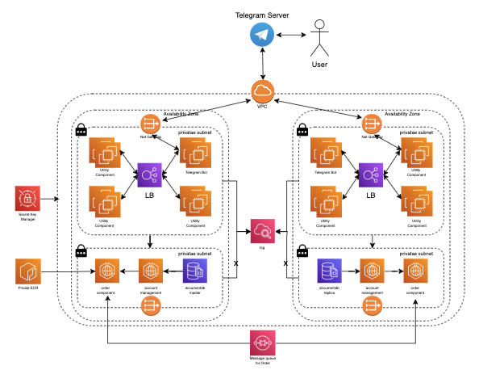
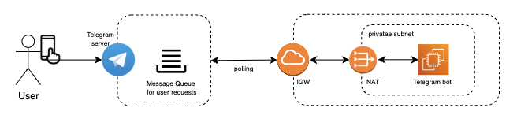
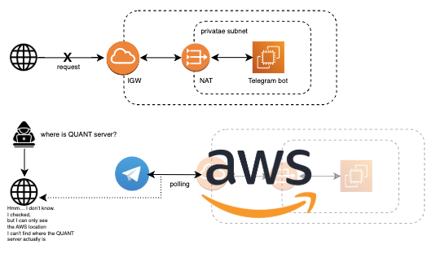
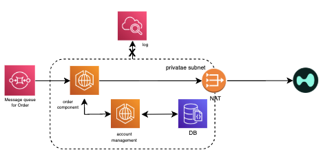
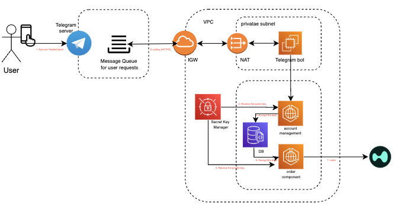

## Platform Architecture Overview

The diagram below illustrates the full system architecture of the HypurrQuant platform.
It shows how we’ve designed a **multi-AZ, private-subnet-based infrastructure**,
ensuring **maximum security, isolation, and encryption at every layer**.

---
## 🔐 Overview of Our Encryption Architecture

---

### 1️⃣ **Bot Server Obfuscation**

Even Telegram itself cannot identify the location of our Telegram Bot.
We do not expose any open ports to the public, and communication is done **exclusively via polling through a NAT Gateway**.
As a result, the bot server is **never exposed externally**, and its location **cannot be detected**.

---

### 2️⃣ **Fully Isolated Service Deployment**

All services are deployed **strictly within AWS Private Subnets**,  
ensuring that **direct access from the internet or any external source is completely blocked**.  
Even if a packet is intercepted mid-route,
the only information visible would be **AWS’s IGW (Internet Gateway) endpoint** —  
**the actual QUANT server’s location and identity remain entirely hidden**.

> 🚫 An attacker has no access to any IP, DNS, or port.

But let’s assume that, by some means, the attacker manages to discover the system’s location
and even **gains unauthorized access to the server**.  
To extract any user data, they must first overcome the following security barriers:

---

### 3️⃣ **Strict Data Access Control & No Logging Policy**

Access to the user data stored in our databases is strictly limited  
to only the **Account Management Server** and the **Order Server**.  
Even then, **no sensitive information is ever logged** on these servers.  
This means that even if an attacker infiltrates the system,  
**nothing is recorded, nothing is retained, and there is no trace to follow.**

---

### 4️⃣ **Asymmetric Encryption-Based Order Processing**

User accounts are either generated internally or imported,
and the private keys are **encrypted using asymmetric encryption (Public Key)**.
**Decryption is strictly limited to the Order Server**,
which operates under the **highest level of isolation and security** within our infrastructure.

The Order Server does not expose **any open ports**
and is **inaccessible even from within the VPC**.
It only receives instructions **via SQS messaging queues**,
and **only upon verification** of the request does it perform a temporary decryption in memory,
**followed by immediate memory disposal.**

---

