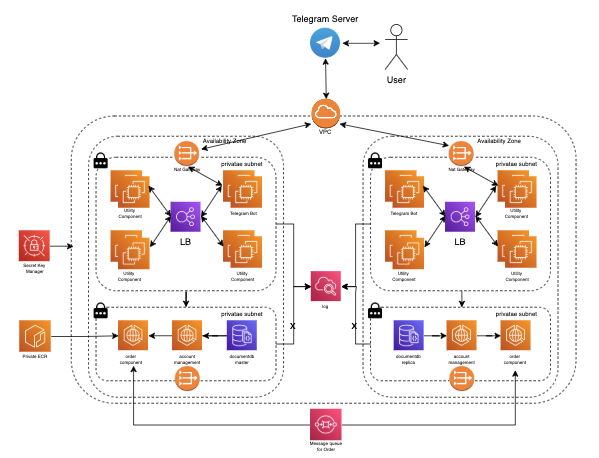
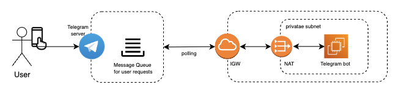
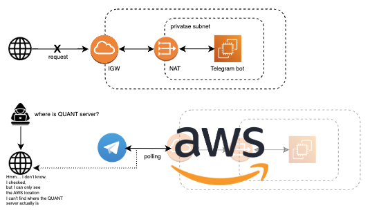
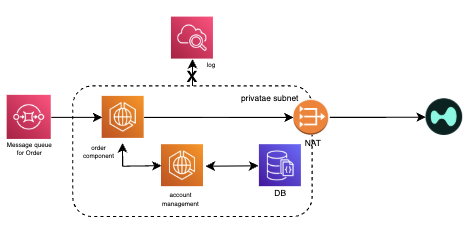
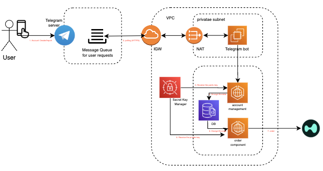

## How Self-Custody Works

HypurrQuant is a **self-custodial wealth management platform** — the architecture is built so we can **execute on your behalf without ever taking custody** of your funds.

- **Keep ownership.** Your assets stay in your own wallet through **account abstraction (ERC-4337)**. There is no HypurrQuant-controlled custody account that holds your capital.
- **Delegate execution.** You grant **revocable session keys** scoped to specific actions and limits. HypurrQuant can analyze, allocate, and automate within those bounds — but the keys can never withdraw your funds, and you can revoke them at any time.
- **Verifiable on-chain.** Positions, yield sources, and execution are settled on-chain, so what HypurrQuant does on your behalf is transparent and auditable.

The infrastructure below hardens the execution layer that powers this — particularly the HypurrQuant Bot, which signs and submits transactions on your behalf within the limits you set.

---

## Platform Architecture Overview
The HypurrQuant Bot runs on a **multi‑AZ, private‑subnet** infrastructure to guarantee maximum security, isolation, and end‑to‑end encryption.

---

## Detail of Our Encryption Architecture

### 1️⃣ **Bot Server Obfuscation**

• **No public ingress**: All Telegram traffic uses outbound polling via NAT Gateway.  
• **Hidden endpoint**: The bot server never exposes ports or IPs.

### 2️⃣ **Fully Isolated Service Deployment**

• **AWS Private Subnets**: All services run with zero inbound internet access.  
• **Opaque networking**: Intercepted packets reveal only AWS IGW, not our servers.

> 🚫 **Attackers cannot see IPs, DNS, or ports.**

### 3️⃣ **Strict Data Access Control & No Logging Policy**

• **Limited DB access**: Only Account Management and Order Servers may query user data.  
• **No sensitive logs**: No user data is ever written to disk or log streams.

### 4️⃣ **Asymmetric Encryption-Based Order Processing**

• **Key storage**: Private keys encrypted with the platform’s public key.  
• **Order Server isolation**: Runs in a locked-down subnet, no open ports.  
• **Message‑driven**: Receives SQS instructions, verifies, then decrypts in‑memory only and immediately purges.

---
