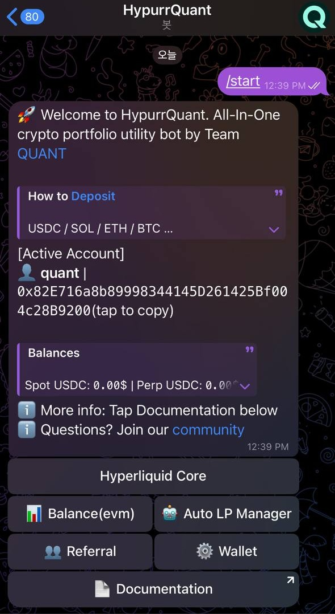

## Fee Structure
- **No performance fee**
- **0.005% builder fee**
- **0.1% Swap fee(EVM)**

## Features
**Hyperliquid L1**
- DCA (Dollar Cost Averaging)
- Copy Trading
- Grid Trading
- Delta Neutral Strategy  
  
**HyperEVM**
- Automated LP Management Service on HyperEVM 

